```{r setup, include=FALSE}
knitr::opts_chunk$set(echo = TRUE, message = FALSE)
```

## A quién está dirigido
Este documento está dirigido a todas aquellas personas que quieran hacer mapas en R o QGIS (dos entornos con software libre) utilizando un mapa base, y que entiendan del reclamo de Argentina de soberanía sobre las Islas Malvinas.

A su vez, el documento está dirigido a quienes ya conozcan el mapa base Argenmap v2 del Instituto Geográfico Nacional y quieran utilizarlo o promover su uso en R o QGIS.

Si bien este documento no provee una solución explícita para Python ni para otros softwares/lenguajes libres, invito a contribuir a quienes lo deseen: posiblemente algo de lo aquí documentado pueda ser de utilidad. Por otro lado, en los softwares privativos de Sistemas de Información Geográfica muy probablemente podrá utilizarse la solución provista para QGIS, basada en XYZ tiles.

## Motivación
Las Islas Malvinas son muchas veces etiquetadas con un nombre incorrecto, no consistente con nuestro reclamo histórico y vigente de soberanía sobre las islas. ¿Por qué los argentinos y argentinas generan mapas con un nombre distinto a "Islas Malvinas"? Al discutirlo con colegas, me encuentro con que algunas personas justifican el error porque, dicen, sus mapas están en inglés. Pero ojo: *la única traducción de "Islas Malvinas" al inglés es "Malvinas Islands"*. Así lo considera Cancillería Argentina (ver por ejemplo este documento en inglés: <https://www.cancilleria.gob.ar/en/news/newsletter/question-malvinas-islands-support-argentinas-claim>). Usar el nombre inglés o usar un binomio (Nombre argentino / Nombre inglés) implica simbólicamente un retroceso en nuestra reivindicación de soberanía sobre las islas.

Quienes sólo tengan interés en la solución práctica, pueden saltearse el próximo apartado sobre el origen del problema e ir a la sección *Protocolo para R* ó *Protocolo para QGIS*.

## Agradecimientos
El protocolo fue redactado en julio de 2020, con colaboración de *Malena Libman* que señaló por dónde iba la solución: usar como mapa base a Argenmap v2, un gran trabajo elaborado por el Instituto Geográfico Nacional (IGN) de la República Argentina.

Agradezco también a *Priscilla Minotti* por los comentarios que mejoraron el script de R y por sugerirme escribirlo en Rmd y dejarlo en Github; y a *R-Ladies* (Buenos Aires, Santa Rosa y General Pico) por varios talleres y por la ayuda con Rmd, Git y otros temas. 

El repositorio del proyecto en *Github* está en: <https://github.com/nmorandeira/IGN_Malvinas>.


-------------
# Introducción a la problemática
## El origen del problema: los mapas base
Tanto en QGIS como en R (en las representaciones con Leaflet), solemos usar como mapas base a las capas de *OpenStreetMap (OSM)* o de otros proveedores. En QGIS, lo hacemos a través de _XYZ tiles_; en R a través de los _proveedores de Leaflet_. Hay muchos proveedores de Leaflet (ver más adelante, spoiler: ninguno de los usualmente listados dice "Islas Malvinas"), pero voy a enfocarme en OSM porque es uno de los más usados y porque tiene muchas ventajas frente a otros.
En contraste con otros proveedores de datos geográficos, OSM es libre: podemos descargar la información, usar en nuestras publicaciones mapas con sus datos y también aportar mapeando (como hacen muchas personas en nuestro país). Sin embargo, OSM es un proyecto global y no reconoce nuestra soberanía sobre las islas. 

¿Cómo se ven las Islas Malvinas en los mapas de OSM (los que por defecto cargamos en R - Leaflet y usualmente en QGIS)? 
Así: https://www.openstreetmap.org/#map=7/-52.770/-66.176

Por defecto, OSM representa los nombres en el lenguaje del país local (por ejemplo, si navegamos en el mapa de OSM podemos ver que los nombres de localidades de Brasil están en portugués y los nombres de localidades de China están en chino). En el caso de las Malvinas, al asignar las islas a los _"territorios británicos de ultramar"_ les asigna el nombre "Falkland Islands". Aquí un detalle de la información asociada a la *Relación 2185374* de OSM, correspondiente al territorio de las Islas Malvinas. Copio y comento las partes más relevantes a esta discusión:

|*Relación 2185374 de OSM*|*Comentario*|
|------|------|
| 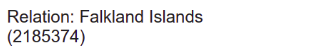{width=60%}|El nombre asignado a la relación 2185374 ya es indicativo del problema.|
| 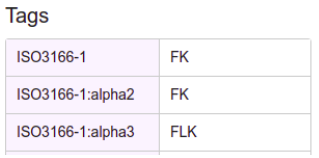{width=60%}|Algunas etiquetas. Adivinen qué significa FK.|
| 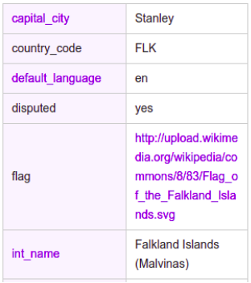{width=60%}|OSM dice que: la capital es Stanley (¿Puerto Argentino?), el idioma por defecto, según OSM, es inglés. ¿Son territorios disputados? Sí. Pero la bandera es de una jurisdicción supuestamente inglesa; y el nombre internacional es "Falkland Islands (Malvinas) (según se señala más abajo, sería la convención de las Naciones Unidas, pero tampoco es la etiqueta que se muestra por defecto)".|
| 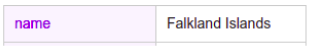{width=60%}|Esta etiqueta "name" es la más importante: es como por defecto se llama a las islas en todos los mapas que despleguemos. Acá está nuestro problema de mapeo.|
| 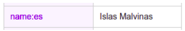{width=60%}|Esta etiqueta "name:es" podría ser una solución parcial. Significa: "nombre en español". Vamos más adelante sobre ese punto.|
| 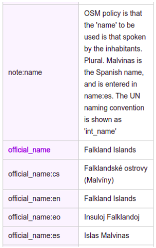{width=60%}|De aquí me interesa destacar la nota, porque me fue señalada por parte de la comunidad de OSM. La traducción literal de la nota es: _"La política de OSM es que el 'name' a ser utilizado es el hablado por los habitantes. Plural. Malvinas es el nombre en español, y es ingresado en name:es. La convención de las Naciones Unidas se muestra como 'int_name'."_. Sin embargo, esta aclaración desconoce al menos dos cuestiones: 1) Hay un tema de soberanía, no de traducción: la única traducción de Islas Malvinas al inglés es Malvinas Islands; 2) El lenguaje oficial de Argentina es el castellano o español. Por otro lado, ¿por qué OSM --que reconoce que hay un territorio en disputa-- considera más conveniente usar el nombre en "name:es" y no (al menos) el nombre en "int_name" que es convención en Naciones Unidas?|
| 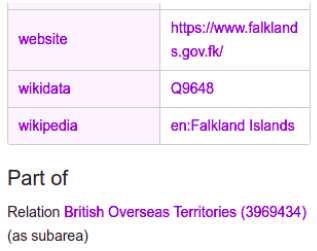{width=60%}|Más información sobre las fuentes de información asociadas al objeto. Muy curioso: el objeto es parte de los "territorios británicos de ultramar", que parecen ser territorios ocupados y colonias desperdigados por todo el mundo: <https://www.openstreetmap.org/relation/3969434>|

-------------

## Soluciones parciales
Una solución parcial sería cargar en nuestros mapas la etiqueta _name:es_ por defecto. ¿Qué implicaría? Que usaríamos el nombre en castellano, no sólo para las Islas Malvinas, sino para cualquier territorio, incluyendo Brasil y China (siguiendo el ejemplo de más arriba). No resuelve el problema de fondo sobre cómo se posiciona OSM ante el conflicto, pero sería una solución parcial. Sin embargo, esto no es tan fácil de hacer para usuarias/os finales (a quienes va dirigido este documento).

Una ventaja de que OSM sea libre es que puede ser descargado y vuelto a subir en otros servidores, como por ejemplo se ha hecho en *OSM-Argentina*, que pudo solucionar algunos problemas (el nombre de las islas) pero no otros (el nombre de ciudades y accidentes geográficos): <https://openstreetmap.org.ar/#6.11/-53.41/-63.924>.

Por otro lado, el *Instituto Geográfico Nacional* (IGN) sí lo resuelve: en su *Argenmap v2* representa correctamente la toponimia oficial de las jurisdicciones y accidentes geográficos de Argentina. Acá encuentran documentación de qué información representa Argenmap: <https://www.ign.gob.ar/AreaServicios/Argenmap/Introduccion>, básicamente _"utiliza los datos oficiales publicados por el Instituto Geográfico Nacional a través de su servicio WMS hasta la escala 1:250.000 (es decir, a partir del nivel de zoom 12)"_. Aquí pueden ver cómo quedan las Islas Malvinas: <https://mapa.ign.gob.ar/>. Podemos notar que no sólo es correcto el nombre de las islas, sino también el de la "Provincia de Tierra del Fuego, Antártida e Islas del Atlántico Sur". Y también el nombre de ríos, lagunas, cerros, montañas, etc (zoom en las islas o, por qué no, en un área que cada una/o conozca, por ejemplo en los humedales del Paraná están cargados los nombres oficiales de las lagunas).

### Conclusión
La mejor solución para nuestro problema de representación de las Islas Malvinas es usar como mapa base a Argenmap v2 de IGN.

-------------

# Protocolos para el uso del mapa base Argenmap v2 de IGN
## Ejercicio tipo
Para practicar la visualización de datos geográficos con R y QGIS, planteo un _ejercicio tipo_. El objetivo del ejercicio es representar las áreas protegidas de Argentina y los límites de la zona económica exclusiva (ambas capas son de IGN) en R, con un mapa base adecuado. En particular, nos interesa representar al Área Protegida Banco Burwood II y su entorno, con un mapa base adecuado.

-------------

## Protocolo para R
### Uso de un mapa base de Argenmap v2 (IGN) con Leaflet
El primer paso es obtener las capas de datos (áreas protegidas y límites de la zona económica exclusiva) del sitio oficial de IGN y descomprimirlas:

```{r descarga_datos}
areasprotegidas <- tempfile()
download.file("http://ramsac.ign.gob.ar/operaciones_sig/shp_from_geoserver/download.php?f=c2hwOjphcmVhX3Byb3RlZ2lkYS56aXA%3D",areasprotegidas, mode="w") 
unzip(areasprotegidas, exdir = "data/") 

limite_ZEE <- tempfile()
download.file("http://ramsac.ign.gob.ar/operaciones_sig/shp_from_geoserver/download.php?f=c2hwOjpsaW5lYV9kZV9saW1pdGVfMDcwMTA3LnppcA%3D%3D",limite_ZEE, mode="w") 
unzip(limite_ZEE, exdir = "data/")
```
Se trata de dos capas de con representación de tipo vectorial _shapefile_, una con polígonos y la otra con líneas. Ahora las cargaremos en R, como objeto espacial de tipo vectorial.

```{r lectura_datos_espaciales}
library(sf)
areasprotegidas <- st_read("data/area_protegida.shp", quiet=TRUE) 
limite_ZEE <- st_read("data/linea_de_limite_070107.shp", quiet=TRUE)
```
Vamos ahora a visualizar estas capas en un mapa, usando la librería _tmap_ y el modo interactivo _view_. Primero configuramos la salida del mapa.

```{r libreria_tmap}
library(tmap)
tmap_mode("view") 
```

Ahora elaboramos el mapa.
```{r mapa_tmap, warning=FALSE}
mapa <- tm_shape(areasprotegidas) + 
  tm_polygons(col="green") +
  tm_shape(limite_ZEE) +
  tm_lines(col="violet")
mapa
```
En la parte de abajo a la derecha del mapa dice que se está utilizando el entorno Leaflet e indica qué proveedor de mapas base se está usando. Si bien el proveedor por defecto parece cambiar según la versión y/o el día, durante julio de 2020 pude observar dos representaciones: una con OSM (y el nombre "Falkland Islands") y otra con ESRI (sin nombre ni en las islas ni en ningún otro territorio; ojo: no podemos usar este mapa base en cualquier circunstancia porque no es libre, ver los términos de uso de la licencia).

Vamos a generar el mismo mapa pero con sintaxis de Leaflet (sin usar tmap), en donde podemos modificar el proveedor del mapa base. Hay muchos proveedores por defecto de mapas base, que se pueden cargar en Leaflet con el comando _"addProviderTiles"_. Aquí podemos ver un listado y una previsualización para la zona que querramos recorrer: <https://leaflet-extras.github.io/leaflet-providers/preview/>.
Cargamos las dos librerías necesarias:

```{r librerias_leaflet}
library(leaflet)
library(htmltools)
```

Ejemplo con el mapa base de OpenStreetMap, que muchas veces sale por defecto al usar _tmap_ y que es muy adecuado en otras zonas del país:

```{r mapabase_OSM}
mapa_base1 <-leaflet() %>% 
  addProviderTiles("OpenStreetMap.Mapnik")  %>%
  setView(-60,-50, zoom = 5) 
mapa_base1
```


Otro ejemplo, con el proveedor "Stamen Toner" (que puede ser lindo para usar en otras áreas del país):
```{r mapabase_StamenToner}
mapa_base2 <-leaflet() %>% 
  addProviderTiles("Stamen.Toner")  %>%
  setView(-60,-50, zoom = 5) 
mapa_base2
```

El problema es que NINGÚN proveedor del extenso listado de proveedores que compartí antes dice "Islas Malvinas". Entonces hay que buscar cómo incluir el Argenmap v2 del IGN, que tan bien soluciona nuestro problema de representación.

Agradezco a Malena Libman por facilitar esta información sobre dónde están los "tiles" del IGN y cómo cargarlas con _addTiles_ (en vez de _addProviderTiles_). Este primer código crea un objeto que llamé _mapa_base_IGN_, es decir, el "Mapa base de IGN" en Leaflet.

```{r mapabaseIGN}
mapa_base_IGN <-leaflet() %>% 
  addTiles('http://wms.ign.gob.ar/geoserver/gwc/service/tms/1.0.0/capabaseargenmap@EPSG:3857@png/{z}/{x}/{-y}.png', 
           attribution = "Argenmap v2 - Instituto Geográfico Nacional") %>%
  setView(-60,-50, zoom = 5)
mapa_base_IGN
```

Al hacer un recorrido en el mapa interactivo vemos que efectivamente Argenmap v2 de IGN resuelve el problema de representación de las Islas Malvinas. Y no sólo eso, también resuelve el nombre de la Provincia que las incluye y todas las toponimias oficiales de Argentina (ciudades, nombres de lagunas y ríos, montes, etc).

Ahora que tenemos el mapa base de IGN ya creado, vamos a crear el mapa final del ejercicio, usando el conector _%>%_ para agregar al objeto _mapa_base_IGN_ las capas de polígonos y líneas. En la capa de polígonos de las áreas protegidas, la configuración del parámetro _label_ permite agregar etiquetas sobre las áreas protegidas, que se visualizan al apoyar el cursor.

```{r mapafinal}
mapa <-mapa_base_IGN %>%
  addPolygons(data=areasprotegidas,
              col = "darkgreen",
              fillOpacity = 0.3,
              label=~htmlEscape(areasprotegidas$fna)) %>%
  addPolylines(data=limite_ZEE,
            col = "violet")
mapa
```

-------------
## Protocolo para QGIS 3.xx
### Uso de un mapa base de Argenmap v2 (IGN) con XYZ Tiles
Los ejemplos provistos a continuación son para la versión QGIS 3.14 (la última versión disponible en julio de 2020), pueden cambiar levemente en versiones anteriores 3.xx. 

En primer lugar, vamos a cargar las dos capas vectoriales de interés para el ejercicio tipo.
Los links de descarga de la web de IGN (<https://www.ign.gob.ar/NuestrasActividades/InformacionGeoespacial/CapasSIG>) son: 

* Áreas protegidas (polígonos): <http://ramsac.ign.gob.ar/operaciones_sig/shp_from_geoserver/download.php?f=c2hwOjphcmVhX3Byb3RlZ2lkYS56aXA%3D>
* Límite de la zona económica exclusiva (líneas): <http://ramsac.ign.gob.ar/operaciones_sig/shp_from_geoserver/download.php?f=c2hwOjpsaW5lYV9kZV9saW1pdGVfMDcwMTA3LnppcA%3D%3D>

Bajamos las capas y las descomprimimos. Luego, debemos agregarlas al panel Capas de QGIS con alguno de estos métodos:

* Con el botón _"Añadir capa vectorial"_, 
* Con el atajo de teclado _Ctrl+Shift+V_, 
* Desde el menú _Capa > Añadir capa > Añadir capa vectorial_
* Arrastrando el archivo .shp  hacia el panel de capas desde una carpeta o desde el panel Navegador. 

Luego podemos cambiar la simbología de las capas de acuerdo a nuestra preferencia. 

Para cargar mapas bases en QGIS 3.xx, se utilizan *XYZ Tiles*. Para comparar, vamos a cargar dos mapas bases, el de OpenStreepMap y el de Argenmap v2 de IGN. Hay muchos mapas bases en formato XYZ, aquí hay una guía muy útil: <https://mappinggis.com/2018/03/como-anadir-mapas-base-en-qgis-3-0-openstreetmap-google-carto-stamen/>.

En el panel "Navegador" (si no se ve, agregarlo: _Ver > Paneles > Navegador_), buscar *XYZ Tiles*. Hacer clic derecho y luego clic en _"Conexión nueva"_. 

El primer ejemplo es para OSM. En el nombre de la conexión, escribimos un nombre a elección. En la URL pegamos: <https://tile.openstreetmap.org/{z}/{x}/{y}.png>. El resto lo podemos dejar por defecto.

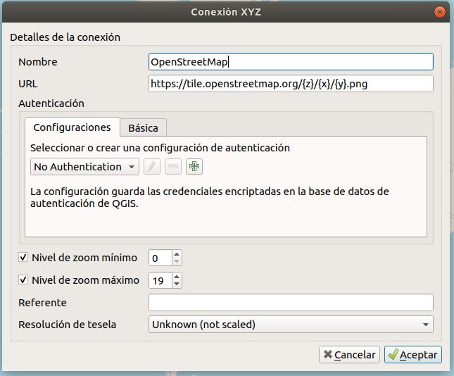{width=50%}

Luego, haciendo doble click en la capa o arrastrándola desde el panel del Navegador al panel de Capas, podemos desplegar el mapa base de OSM. Para desplegar las capas en orden, es necesario mover el mapa base debajo de los archivos vectoriales. Obtendremos algo similar a esto:

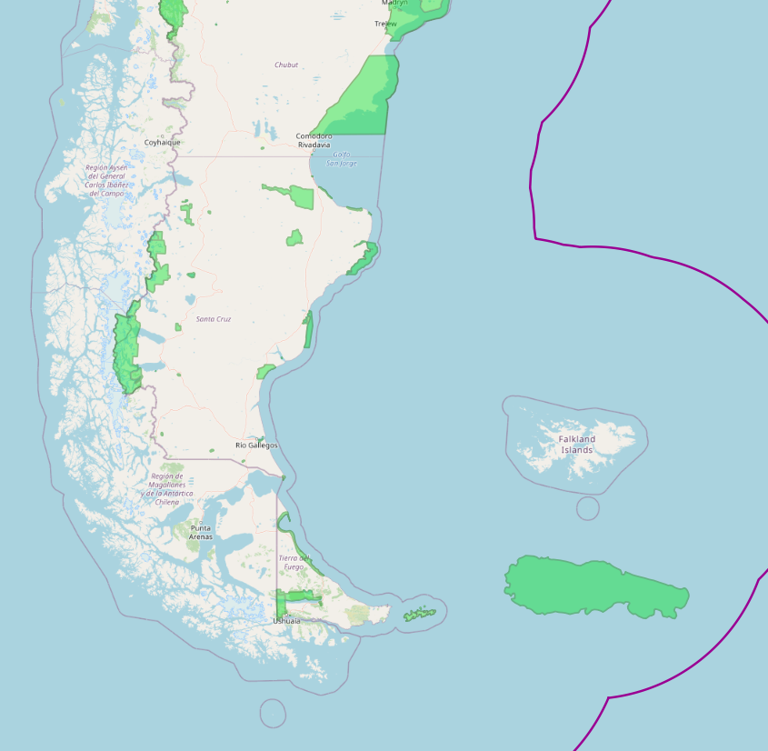{width=50%}

Para cargar el mapa base Argenmap v2 de IGN, volvemos a las XYZ tiles y creamos una nueva conexión. En este caso la URL es <http://wms.ign.gob.ar/geoserver/gwc/service/tms/1.0.0/capabaseargenmap@EPSG:3857@png/{z}/{x}/{-y}.png>.

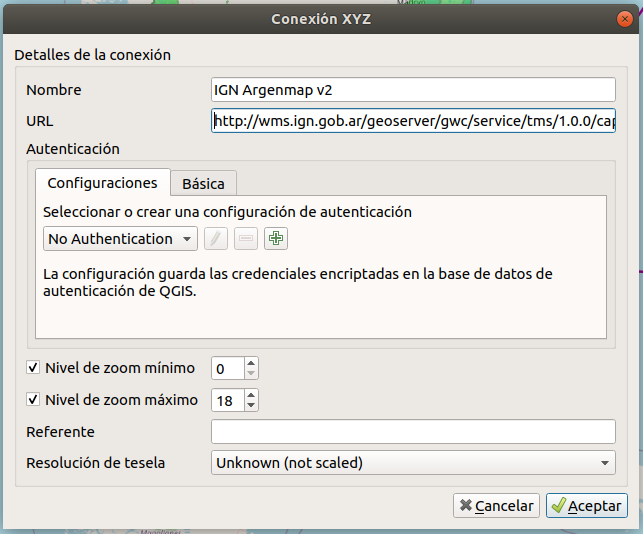{width=50%}

Ahora sí obtenemos el mapa deseado:

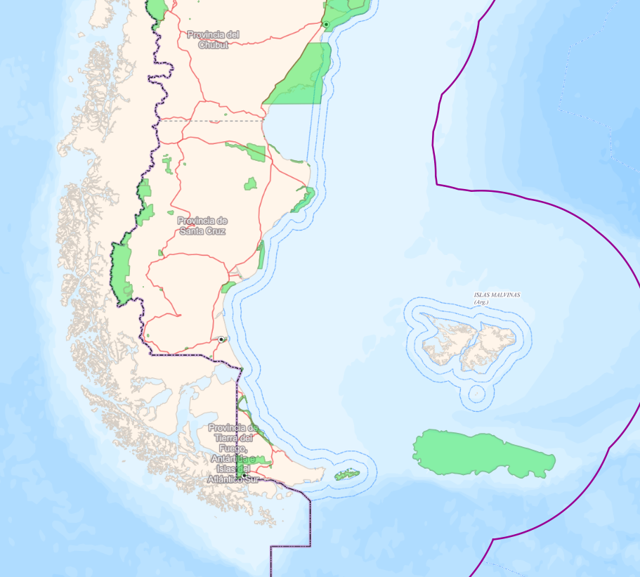{width=50%}

Dejo a disposición el proyecto de este ejercicio tipo, aquí: <https://github.com/nmorandeira/IGN_Malvinas/blob/master/IGN_Malvinas.qgz?raw=true>.
Una visualización general del proyecto y las capas XYZ en los paneles Navegador y Capas es:

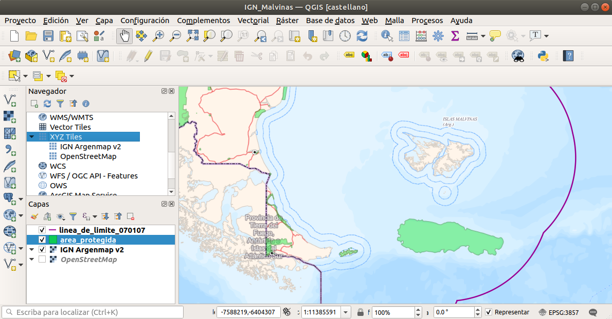{width=80%}


